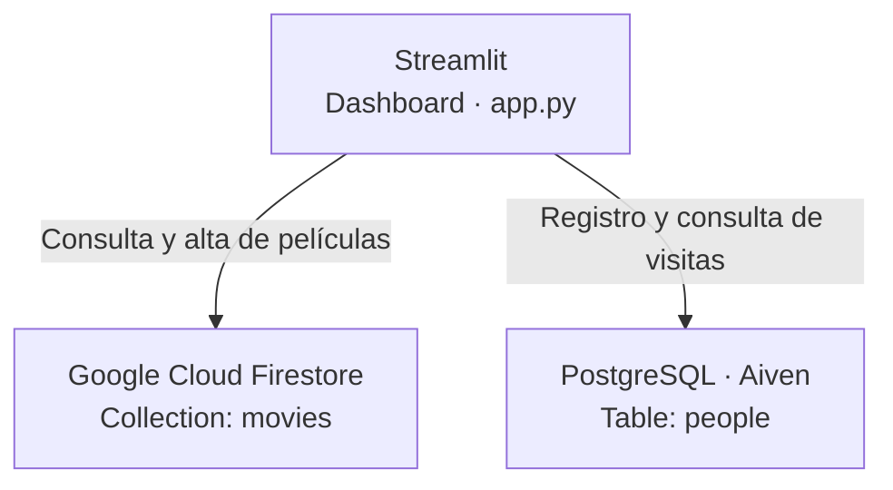
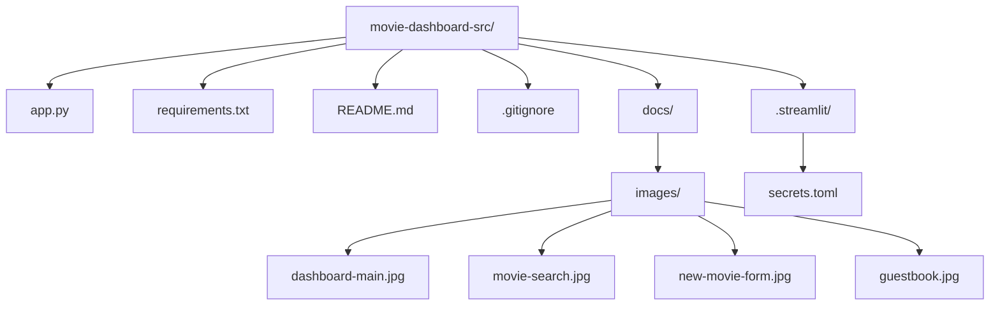
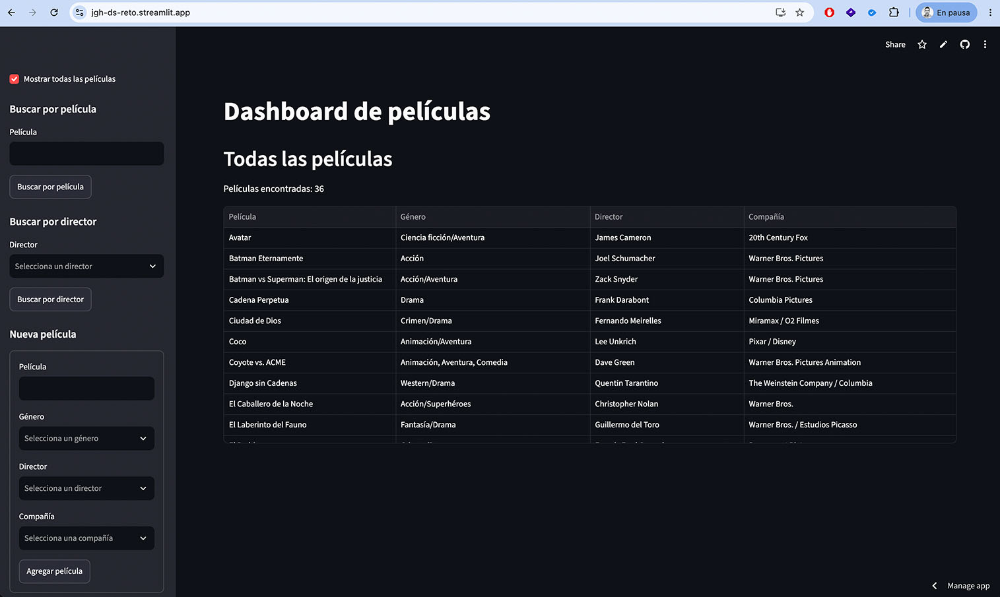
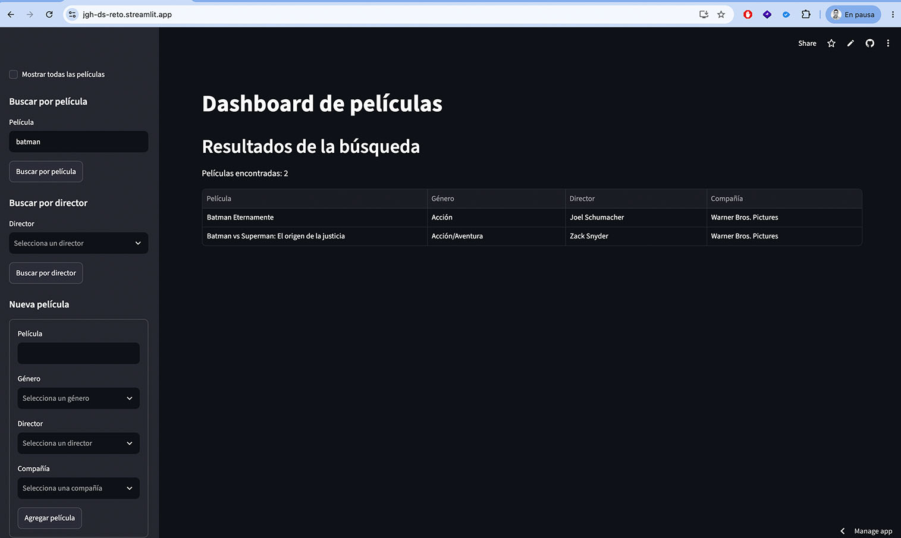
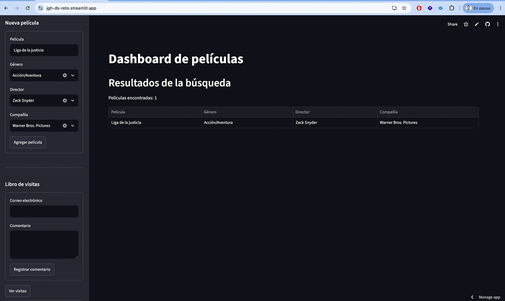
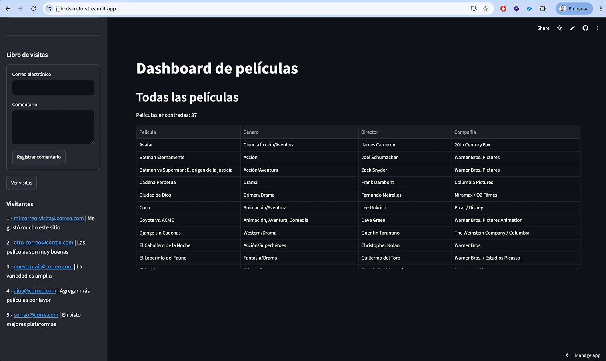

# Dashboard interactivo de películas con Streamlit

Aplicación web desarrollada con **Python y Streamlit** para consultar y administrar una colección de películas almacenada en **Google Cloud Firestore**, además de registrar y consultar comentarios de visitantes en **PostgreSQL**.

> **TL;DR:** Dashboard desarrollado con Streamlit que utiliza Firestore para administrar películas y PostgreSQL para un libro de visitas. Incluye búsqueda, filtros, alta de películas y despliegue en Streamlit Cloud.

## URLs del proyecto

Repositorio GitHub:

```text
https://github.com/mzd-jesus-gutierrez/streamlit-dc-jgh
```

Aplicación desplegada:

```text
https://jgh-ds-reto.streamlit.app/
```

## Descripción

Este proyecto fue desarrollado como parte del **Módulo 13 - Desarrollo web para portal de inteligencia analítica**.

El objetivo es construir y desplegar una aplicación interactiva capaz de integrar dos fuentes de datos distintas:

- **Google Cloud Firestore** para almacenar y consultar películas.
- **PostgreSQL** para administrar un libro de visitas.

La aplicación fue desarrollada en Visual Studio Code, publicada en GitHub y desplegada en Streamlit Cloud.

## Funcionalidades

- Visualización del catálogo completo de películas.
- Búsqueda de películas por título mediante coincidencia parcial.
- Búsqueda sin distinción entre mayúsculas y minúsculas.
- Filtro de películas por director.
- Alta de nuevas películas en Firestore.
- Selección de género, director y compañía a partir de valores existentes en la colección (solo para fines del reto).
- Registro de comentarios en PostgreSQL.
- Consulta de visitantes y comentarios desde el sidebar.
- Despliegue en producción mediante Streamlit Cloud.

## Tecnologías utilizadas

- Python
- Streamlit
- Pandas
- Google Cloud Firestore
- PostgreSQL
- SQLAlchemy
- Git (GitHub)
- Streamlit Cloud

## Arquitectura



Firestore almacena los datos principales de las películas, mientras que PostgreSQL se utiliza para el libro de visitas.

## Estructura del proyecto



> `.streamlit/secrets.toml` contiene credenciales y no debe versionarse ni publicarse en GitHub.

## Dependencias

El archivo `requirements.txt` contiene únicamente las dependencias utilizadas por la aplicación:

```txt
streamlit
pandas
google-cloud-firestore
sqlalchemy
psycopg2-binary
```

## Instalación local

### 1. Crear un ambiente virtual

```bash
python3 -m venv movie-env
```

En macOS o Linux:

```bash
source movie-env/bin/activate
```

En Windows PowerShell:

```powershell
movie-env\Scripts\Activate.ps1
```

### 2. Instalar dependencias

```bash
pip install -r requirements.txt
```

### 3. Configurar secretos

Crear el archivo:

```text
.streamlit/secrets.toml
```

La estructura utilizada por la aplicación es la siguiente:

```toml
[connections.postgresql]
dialect = "postgresql"
host = "..."
port = "..."
database = "..."
username = "..."
password = "..."

[firestore]
"type" = "service_account"
"project_id" = "..."
"private_key_id" = "..."
"private_key" = "..."
"client_email" = "..."
"client_id" = "..."
"auth_uri" = "https://accounts.google.com/o/oauth2/auth"
"token_uri" = "https://oauth2.googleapis.com/token"
"auth_provider_x509_cert_url" = "https://www.googleapis.com/oauth2/v1/certs"
"client_x509_cert_url" = "..."
"universe_domain" = "googleapis.com"
```

No se deben colocar credenciales reales dentro del repositorio.

## Ejecución local

Con el ambiente virtual activo:

```bash
streamlit run app.py
```

Streamlit iniciará la aplicación localmente y mostrará la URL correspondiente en la terminal.

## Configuración de datos

### Firestore

La aplicación utiliza una colección llamada:

```text
movies
```

Cada documento contiene los campos:

```text
name
genre
director
company
```

### PostgreSQL

La aplicación utiliza una tabla llamada:

```text
people
```

con los campos:

```text
email
comment
```

## Despliegue en Streamlit Cloud

La aplicación se despliega mediante:

[https://share.streamlit.io/](https://share.streamlit.io/)

El flujo general de despliegue es:

1. Publicar el código fuente en GitHub.
2. Crear una nueva aplicación en Streamlit Cloud.
3. Seleccionar el repositorio, branch y archivo principal `app.py`.
4. Abrir la configuración avanzada de la aplicación.
5. Copiar el contenido de `.streamlit/secrets.toml` en la sección **Secrets** de Streamlit Cloud.
6. Guardar la configuración y desplegar.

Los secretos de PostgreSQL y Firestore se configuran directamente en Streamlit Cloud y no forman parte del repositorio público.

## Capturas

### Dashboard principal



### Búsqueda de películas



### Alta de película



### Libro de visitas



## Seguridad

Las credenciales de Firestore y PostgreSQL se mantienen fuera del repositorio mediante `secrets.toml` y la configuración de Secrets de Streamlit Cloud.

El archivo `.gitignore` debe excluir, como mínimo:

```gitignore
.streamlit/secrets.toml
movie-env/
```

## Contexto del reto

Proyecto desarrollado para el **Módulo 13 - Desarrollo web para portal de inteligencia analítica**, enfocado en la integración de Streamlit con bases de datos relacionales y no relacionales, así como su despliegue en producción.
